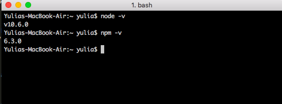

- **Start Date:** 2018-08-18
- **PR:** 
- **Issue:** [#60](https://github.com/nodejs/website-redesign/issues/60)
- **Keywords:** install node mac 
- **Summary:** Instruction how to install node.js on MacOS using Homebrew

# Installation of Node.js

Node.js is a tool for building fast network applications. It's known as a "JavaScript runtime environment" which simply means it lets you write JavaScript code that can run on your computer free of any web browser. Node.js is used to create fast web servers by companies like Walmart, eBay and Netflix.

## Body Content

### Preparation 
Before installation of Node you should have Homebrew installed on your machine. 
If it's not installed, just open Terminal and type: **ruby -e "$(curl -fsSL https://raw.githubusercontent.com/Homebrew/install/master/install)"**. You'll see messages in the Terminal explaining what you need to do to complete the installation process.

### Installation 
Installation of Node with Homebrew is pretty straightforward - open the Terminal app and type **brew install node**.

To make sure you have Node and NPM installed, run two simple commands to see what version of each is installed:
1. To see if Node is installed, type **node -v** in Terminal. This should print the version number so you'll see something like this v10.6.0
2. To see if NPM is installed, type **npm -v** in Terminal. This should print the version number so you'll see something like this 6.3.0

### Updating 
New versions of Node and NPM come out frequently. You can use Homebrew to update the software it installs.
To upgrade Node type in Terminal **brew upgrade node**

### Uninstallation 
To uninstall Node type in Terminal **brew uninstall node**

## Conclusion

With Node.js and NPM installed you’ll soon be able to take advantage of the huge world of NPM modules that can help with a wide variety of tasks both on the web server and on your desktop (or laptop) machine. The NPM site lists all of the official Node packages making it easy to make the choice.